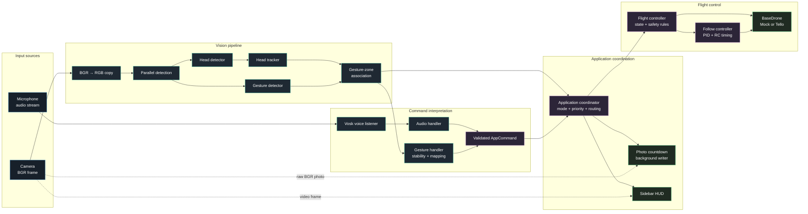

# Tello Computer Vision

Voice- and gesture-controlled DJI Tello flight using MediaPipe vision, Vosk
speech recognition, persistent head tracking, and PID-based autonomous follow.

The application supports two environments:

- **Mock mode** uses a webcam and simulated drone for development.
- **Tello mode** uses the drone camera and DJI Tello SDK.

The application always starts **idle in voice mode**. Say **“take off”** before
issuing movement, follow, rotation, or flip commands.

## Features

- Voice and custom-trained gesture control through one shared command model.
- MediaPipe face detection and hand-gesture recognition in parallel workers.
- Persistent multi-head tracking with EMA-smoothed bounding boxes.
- PID follow control for yaw, forward/backward distance, and altitude.
- Explicit flight-state validation, command cooldowns, and flip recovery lock.
- Three-second, nonblocking photo countdown with background file writing.
- Side-by-side display with an unobstructed camera feed and dedicated HUD.
- Mock drone and automated tests that do not require physical hardware.

## Quick Start

### Requirements

- Python 3.11 or newer
- Webcam for mock mode
- DJI Tello connected over Wi-Fi for hardware mode
- Microphone for voice commands

Required model assets:

```text
core/vision/models/mediapipe/blaze_face_full_range.tflite
core/vision/models/mediapipe/trained_gesture_recognizer.task
core/voice/models/vosk-model-small-en-us-0.15/
```

### Installation

```bash
python -m venv .venv
```

Activate the environment:

```powershell
# Windows PowerShell
.venv\Scripts\Activate.ps1
```

```bash
# macOS/Linux
source .venv/bin/activate
```

Install runtime dependencies:

```bash
python -m pip install --upgrade pip
python -m pip install -r requirements.txt
```

### Run

```bash
# Webcam and simulated drone
python main.py --drone mock

# Real DJI Tello
python main.py --drone tello
```

Startup sequence:

1. The application opens in `IDLE` and `VOICE` mode.
2. Say **“take off”**.
3. Wait for the HUD state to show `FLYING`.
4. Continue with voice commands or say **“gesture mode”**.

Keyboard controls:

| Key | Action |
|---|---|
| `d` | Toggle head IDs, gesture zones, landmarks, and tracking guides |
| `q` | Safely land if necessary and exit |

## Voice Commands

| Phrase | Command |
|---|---|
| `take off` | Take off from idle |
| `land` | Land from flying or following |
| `follow me` | Follow the best available tracked head |
| `stop`, `stop following` | Stop following and zero RC movement |
| `go up`, `go down` | Move vertically 30 cm |
| `go left`, `go right` | Move sideways 30 cm |
| `go forward`, `go back` | Move forward/backward 30 cm |
| `come closer`, `go away` | Move forward/backward 50 cm |
| `rotate left`, `rotate right` | Rotate 90 degrees |
| `flip`, `flip forward` | Flip forward |
| `flip back`, `flip left`, `flip right` | Flip in the requested direction |
| `take photo`, `take a photo` | Capture a photo after three seconds |
| `gesture mode` | Switch to gesture control |
| `voice mode` | Switch to voice control |

The microphone remains active in gesture mode. For safety, only **“voice mode”**
and emergency **“land”** are accepted by voice while gesture mode is active.

## Gesture Commands

Gestures must remain stable for three consecutive frames and must be inside a
tracked head’s gesture zone. A held gesture emits only one command; release or
change the gesture before using it again.

| Model label | Command |
|---|---|
| `like` | Move up 30 cm |
| `dislike` | Move down 30 cm |
| `fist` | Start following |
| `stop` | Stop following |
| `ok` | Land |
| `grip` | Take a photo after three seconds |
| `one` | Move left 30 cm |
| `peace` | Move right 30 cm |
| `three2` | Rotate left 90 degrees |
| `four` | Rotate right 90 degrees |
| `call` | Switch to voice mode |
| `rock` | Flip forward |

The custom model can occasionally confuse `like` and `call`. This is a model
training limitation rather than a command-routing rule.

## Flight Safety and State

```text
IDLE -> TAKING_OFF -> FLYING <-> FOLLOWING -> LANDING -> IDLE
```

- Takeoff is accepted only from `IDLE`.
- Movement, rotation, and flip are accepted only from `FLYING`.
- Follow starts only when a tracked head is available.
- Losing the target stops RC movement and returns to `FLYING`.
- Normal flight actions have a 0.45-second centralized cooldown.
- A flip starts a three-second recovery lock for flight-changing commands.
- Landing always bypasses action and flip cooldowns.
- Exiting the application lands before closing cameras or disconnecting.

## HUD

The OpenCV window uses a side-by-side layout:

```text
+-----------------------------+------------------+
|                             | State / mode     |
|       camera feed           | Battery / FPS    |
|   and tracking overlays     | Microphone       |
|                             | Command feedback |
+-----------------------------+------------------+
```

The sidebar displays:

- Flight state and active control mode
- Battery level, FPS, and microphone status
- Detected input and interpreted command
- `EXECUTED` or `BLOCKED` with a rejection reason
- Photo countdown and saved confirmation

Common rejection messages include `take off first`, `command cooldown`,
`flip recovery in progress`, and `no tracked target`.

Photos are written to `photos/` and do not include the HUD or tracking overlay.
Only one photo countdown can be pending at a time.

## Architecture



All camera implementations are normalized to OpenCV BGR at their boundary.
The vision pipeline converts a copy to RGB for MediaPipe while preserving the
BGR frame for display and photography.

### Main Components

```text
main.py                              CLI entry point
app/
  main.py                            Concise runtime and ordered cleanup
  application.py                     Input, priority, photo, and mode coordinator
  commands.py                        Shared validated command model
  flight_controller.py               State validation and drone execution
  follow_controller.py               PID target-following RC control
  input/audio_handler.py             Speech phrase to command mapping
  input/gesture_handler.py           Stable gesture to command mapping
  pipeline/vision_pipeline.py        Parallel detection and tracking pipeline
  photo_capture.py                    Background photo writer
  drawing/draw_utils.py              Camera overlays and sidebar HUD
  state.py                           Flight and control-mode state
core/
  camera/                             Webcam and Tello camera adapters
  drone/                              Mock and Tello drone adapters
  tracking/head_tracker.py            Persistent head tracking and gesture zones
  vision/                              MediaPipe detector adapters and models
  voice/voice_listener.py              Background Vosk microphone listener
  voice/phrases.py                     Restricted speech-recognition vocabulary
tests/                                Hardware-independent automated tests
```

## Technical Details

### Follow Control

Three PID controllers produce RC commands:

| Axis | Error | Output |
|---|---|---|
| Yaw | Horizontal target offset | Yaw velocity |
| Forward/back | Target versus actual head-height ratio | Distance velocity |
| Up/down | Vertical target offset | Vertical velocity |

Outputs are clamped to `[-100, 100]` and sent no faster than every 50 ms.

### Tracking

Head detections use greedy nearest-neighbor assignment. Bounding boxes are
smoothed with an exponential moving average (`alpha = 0.8`), and tracks that
have not been observed for one second are removed.

### Photo Capture

The coordinator schedules a three-second countdown without blocking flight
commands or PID updates. When due, the current raw BGR frame is copied and
written by a background worker.

## Testing

Install development dependencies:

```bash
python -m pip install -r requirements-dev.txt
```

Run the full suite:

```bash
python -m pytest -q
```

Run a focused module or matching test name:

```bash
python -m pytest tests/test_flight_controller.py -q
python -m pytest -k "flip" -q
```

The tests use recording drones, synthetic frames, fake voice queues, and fake
vision components; no webcam, microphone, or Tello is required.

## Dependencies

| Package | Purpose |
|---|---|
| `opencv-python` | Camera input, color conversion, drawing, and display |
| `mediapipe` | Face detection and custom gesture recognition |
| `djitellopy` | Tello communication and video streaming |
| `vosk` | Offline speech recognition |
| `sounddevice` | Microphone audio stream |
| `pillow` | Image support |
| `pytest` | Development test runner |

## Safety

Use mock mode while changing command mappings or state rules. Before real
flight, verify battery level, propeller clearance, Wi-Fi connection, emergency
landing, and shutdown behavior in an open indoor area.

This project is provided as-is for educational and experimental use.
